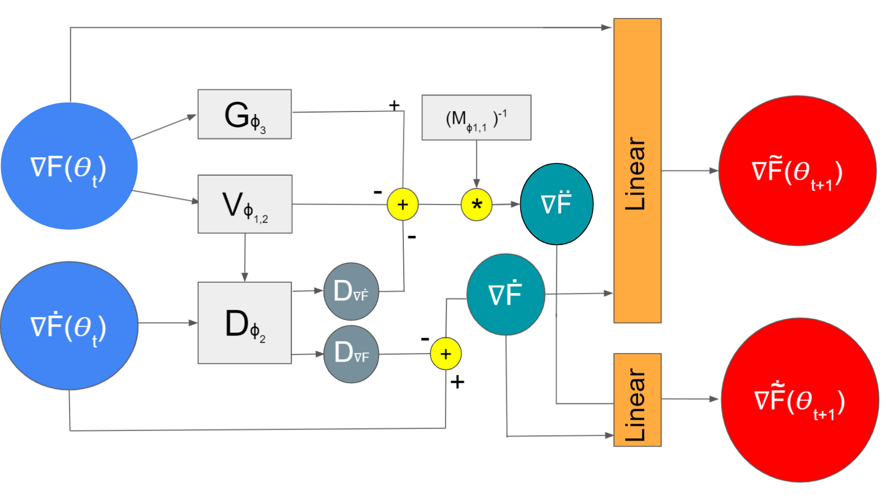

# Can we learn gradients by Hamiltonian Neural Networks?

This project was carried out as part of the Optimization for Machine Learning course (CS-439) at EPFL in the spring 2020 semester. 

*Team*:

   - Aleksandr Timofeev (<aleksandr.timofeev@epfl.ch>)
   - Andrei Afonin (<andrei.afonin@epfl.ch>)
   - Yehao Liu (<yehao.liu@epfl.ch>)
    
 
The No Free Lunch Theorem suggests that there is no universally best learner and restricting the hypothesis class by introducing our prior knowledge about the task we are solving is the only way we can improve the state of affairs. This motivates the use of the learned optimizer for the given task and the use of different regularization methods. For instance, the Heavy Ball method considers the gradient descent procedure as a sliding of a heavy ball on the surface of the loss function, which results in faster convergence. More generally, one can consider the gradient descent procedure as a movement of some object on the surface of the loss function under different forces: potential, dissipative (friction) and other external forces. Such a physical process can be described by port-Hamiltonian system of equations. The optimization process can be considered as the evolution of a port-Hamiltonian system meaning that the parameters of the neural network are the solutions of the port-Hamiltonian system of equations. The results show that this framework helps to overcome the problem of getting stack at saddle points which motivates its use for the non–convex, high–dimensional neural networks. In this work, we propose to learn the optimizer and impose the physical laws governed by the port-Hamiltonian system of equations into the optimization algorithm to provide implicit bias which acts as regularization and helps to find the better generalization optimums. We impose physical structure by learning the gradients of the parameters: gradients are the solutions of the port-Hamiltonian system, thus their dynamics is governed by the physical laws, that are going to be learned. we show that Hamiltonian Neural Networks (based on port-Hamiltonian dynamics) can be used instead of normal optimizers (Adam, SGD, RmsProp, and etc) for models which can be trained by the gradient descent and improve the performance achieved by usual optimizers. The code is written in PyTorch. Results are compared between our model, normal optimizers, and similarly implemented LSTM-based optimizer which is also able to learn gradients.

To test optimizers we use the following tasks:

- [x] Quadratic functions (details are given in `main.ipynb`)
- [x] MNIST

## Prerequisites
- Ubuntu
- Python 3
- NVIDIA GPU

## Installation
* Clone this repo:
```bash
git clone https://github.com/AfoninAndrei/OPT-ML.git
cd OPT-ML
```
* Install dependencies:
```bash
pip install requirements.txt
```
## Usage
* To reproduce the results: simply go through `main.ipynb`. 
* All implementations are in `src`.

## Method

In fact, gradient descent is fundamentally a **sequence** of updates (from the output layer of the neural net back to the input), in between which a **state** must be stored. Thus we can think of an optimizer as a ODE-Net (or RNN).
The loss of the optimizer is the sum (weights are set to 1 in our experiments) of the losses of the optimizee as it learns. 


The plan is thus to use gradient descent on parameters of model-based optimizers in order to minimize this loss, which should give us an optimizer that is capable of optimizing f efficiently.

As the [paper](https://arxiv.org/pdf/1606.04474.pdf) mentions, it is important that the gradients in dashed lines in the figure below are **not** propagated during gradient descent.


Basically this is nothing we wouldn't expect: the loss of the optimizer neural net is simply the average training loss of the optimizee as it is trained by the optimizer. The optimizer takes in the gradient of the current coordinate of the optimizee as well as its previous state, and outputs a suggested update that we hope will reduce the optimizee's loss as fast as possible.

Optimization is done coordinatewise such that to optimize each parameter by its own state. Any momentum or energy term used in the optimization is based on each parameter's own history, independent on others. Each parameter's optimization state is not shared across other coordinates.
The precondition assumed, is that all parameters share the same weights in a model-based optimizer.

In our approach, the role of the optimizer is given to a Hamiltonian Neural Network which is presented in figure below:



## Acknowledgement
* Some parts of the code were taken from here: [chenwydj/learning-to-learn-by-gradient-descent-by-gradient](https://github.com/chenwydj/learning-to-learn-by-gradient-descent-by-gradient-descent).
* The idea of the project has been inspired by [Learning to learn by gradient descent by gradient descent](https://arxiv.org/pdf/1606.04474.pdf) and [Dissipative SymODEN](https://arxiv.org/pdf/2002.08860.pdf)
